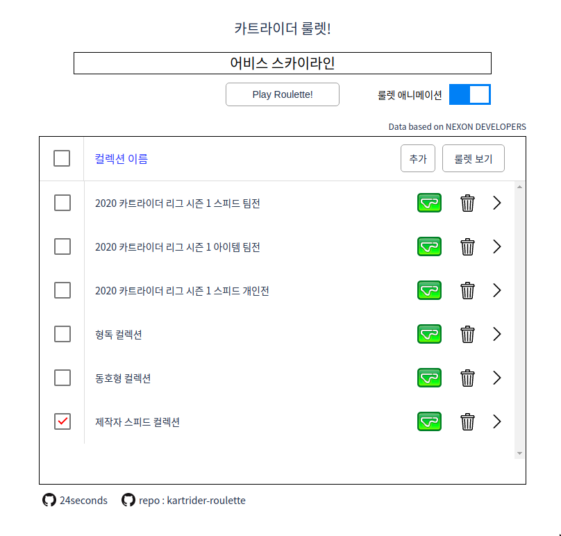
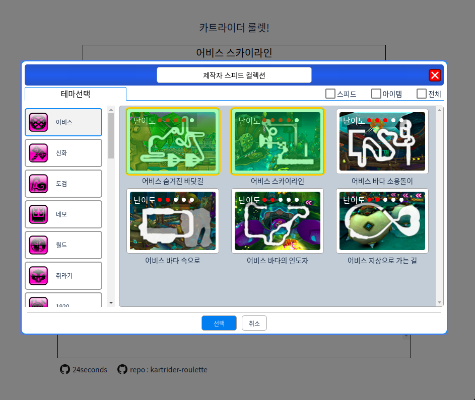
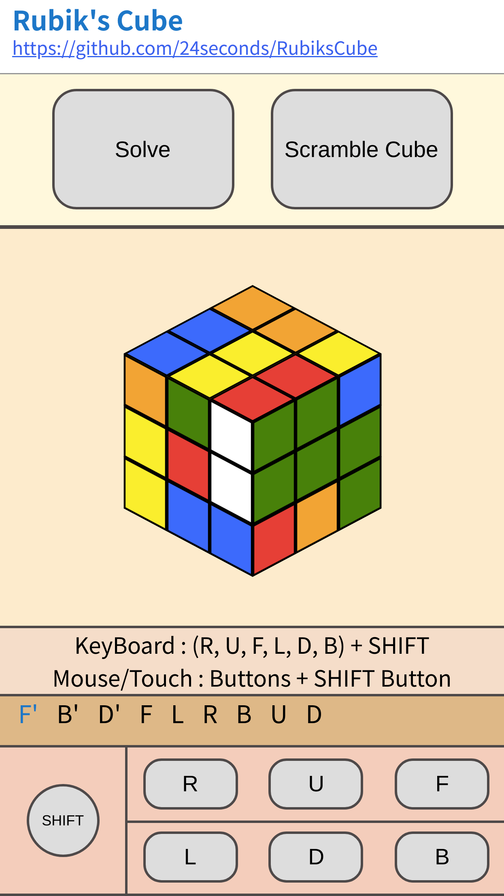

# Resume
Resume!

Updated : Sun 01 Mar 2020

## Info

- Name : GeunYeong, Cheon
- E-mail : 24crazyoung@gmail.com
- Study : CS & NQE at [KAIST](https://www.kaist.ac.kr/html/kr/index.html) (2014 ~ current)
- Status : 산업기능요원 (2019.11 ~ current)

## Work Experience

- ### [MOIN](https://www.themoin.com/) (2018.12.26 ~ 2019.08.19)
    - role : front-end and some back-end part
- ### [VONVON](https://en.vonvon.me/)
   - role : Android kotlin

-----------

## Skill

### Front-end

- HTML, CSS, javascript (responsive, browser compatibility)
- React
- Babel, webpack
- Sass
- Android Kotlin

### Back-end

- Nodejs
- Express
- Sequelize
- SQL

### Others
 - Git
 - Jira, Confluence
 - Trello

-----------

## Projects

### [Kartrider Roulette](https://github.com/24seconds/kartrider-roulette)

#### period: 2020.01 ~ 2020.02

- **demo** : [https://24seconds.github.io/kartrider-roulette/](https://24seconds.github.io/kartrider-roulette/) (support chrome, firefox, windows exe - build using electorn)

- **url** : [https://github.com/24seconds/kartrider-roulette](https://github.com/24seconds/kartrider-roulette)

- info : Implement kartrider roulette

- what I'v learned : 
   - How to build application from scratch considering UI, UX and features. 
   - Indexed DB
   - how roulette animation works (it's more like slot machine animation) timing function and requestAnimationFrame, 
   - electron build

------

### [Baseball Report](https://24seconds.github.io/baseballReport/)

#### period: 2019.12 ~ 2020.01

- **url**: [https://24seconds.github.io/baseballReport/](https://24seconds.github.io/baseballReport/)

- info : Write report of bet system

- what I'v learned  
  - data crawling, how other web site works, process raw data (parse html and get data)  
  - hugo theme, understand http request more

------

### [Rubik's Cube](https://github.com/24seconds/RubiksCube)

#### period : 2019.03 ~ 2019.05

- **demo** : [https://24seconds.github.io/rubikscube/](https://24seconds.github.io/rubikscube/) (`support desktop view and mobile view in chrome`)

- **url** : [https://github.com/24seconds/RubiksCube](https://github.com/24seconds/RubiksCube)

- info : Implement rubik's cube using HTML, CSS, javascript

- team : alone

- what I've learned 
   - how to make application using vanilla js
   - browser frame rendering process (requestAnimationFrame)  
   - gimbal lock, quaternion  
   - how to design application from scratch  

  

-----

### [KENS](https://github.com/ANLAB-KAIST/KENSv3)

#### period : 2018.09 ~ 2018.12

 > Because of KENS policy, I can not show repository.
 
 - info : Implement TCP in C++

 - team : alone

 - what I've Learned : How TCP works

----

### Mad Camp

#### period : 2018.06 ~ 2018.08 (5 weeks in summer, 1 week for each project)

> There is no visible images or videos of projects. But for me, I learned a lot through these projects. That's why I added.

 - info : Doing 5 projects for 5 weeks with teammates.

 - what I've learned : How to collaborate and communicate with other people, how to plan a game or an app

 1. Two Android apps : Basic App that shows contact, gallery and account book with/withouto server
    - team : 2 people
    - role : implement 
    - what I've learned : android, github, how to do programming with others, basic architecture between front-end and back-end 
    - skill : andriod, github, mongoDB
  
 2. 3D dodge : Implement `Gom Player 2D Dodge` in 3D
    - team : 3 people
    - role : implement skill logic and effect, make background
    - skill : unity, github
 
 3. Ricochet robot : Make puzzle game in Unity
    - team : 3 people
    - role : game logic
    - skill : unit, github

 4. Event Web : Showing all events held in KAIST
    - team : 3 people (1 for front-end, 1 for back-end, 1 for DB)
    - role : front-end
    - what I've learned : react, how to communicate with back-end
    - skill : react, github

-----------

## Interest

- React
- Rust
- Infrastructure
- Testing

## Ect

- Language
  - Korean : Native
  - English : Minimum Professional
